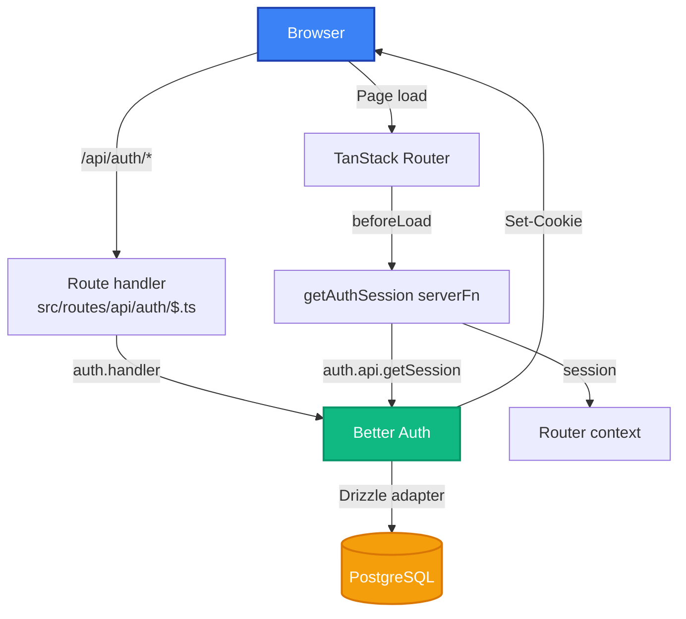

## Overview

Authentication is **Better Auth running inside the TanStack Start server**. The client, the auth
handler and the server functions all live in the same Worker, so the session cookie is same-origin
and no proxy or CORS allowlist is involved.



## The pieces

| File                                            | Role                                                                               |
| ----------------------------------------------- | ---------------------------------------------------------------------------------- |
| `packages/infra-auth/src/config/base-config.ts` | Shared Better Auth options: Drizzle adapter, scrypt password hashing, cookie cache |
| `src/lib/auth/auth-server.ts`                   | The server instance — `baseConfig` plus `tanstackStartCookies()`                   |
| `src/routes/api/auth/$.ts`                      | Mounts `auth.handler` on GET/POST/PUT/PATCH/DELETE                                 |
| `src/lib/auth/get-auth-session.ts`              | Server function that reads the session from request headers                        |
| `src/lib/auth/auth-client.ts`                   | `better-auth/react` client used by the forms                                       |
| `src/routes/_authenticated.tsx`                 | Layout route that redirects unauthenticated visitors to `/auth/login`              |

### The server instance

```typescript
// src/lib/auth/auth-server.ts
import { betterAuth } from "better-auth";
import { tanstackStartCookies } from "better-auth/tanstack-start";
import { baseConfig } from "@port-watcher/infra-auth";

export const auth = betterAuth({
  ...baseConfig,
  plugins: [...(baseConfig.plugins ?? []), tanstackStartCookies()],
});
```

`tanstackStartCookies()` is what lets Better Auth set cookies through the Start server's response,
which is why this pattern needs no proxy.

### Reading the session

`getAuthSession` is a server function, so it runs with the incoming request headers available:

```typescript
export const getAuthSession = createServerFn({ method: "GET" }).handler(
  async (): Promise<AuthSession | null> => {
    const headers = getRequestHeaders();
    const session = await auth.api.getSession({ headers });
    if (!session) return null;
    return { session: session.session, user: session.user };
  },
);
```

The root route calls it in `beforeLoad` and puts the result into the router context, so every route
and component can read `isAuthenticated` and `session` without another round trip.

## Protecting a route

Put the route file under `src/routes/_authenticated/`. The parent layout guards it:

```typescript
// src/routes/_authenticated.tsx
export const Route = createFileRoute("/_authenticated")({
  beforeLoad: async (ctx) => {
    if (!ctx.context.isAuthenticated) {
      throw redirect({ to: "/auth/login" });
    }
  },
});
```

:::caution[The router guard is UX, not security]
`beforeLoad` decides what to render. It does not protect data. **Every server function must check
the session itself**, exactly as `listTodos` does:

```typescript
const session = await getAuthSession();
if (!session) return { data: null, error: { message: "Unauthorized" } };
```

:::

## After signing in or out

Session state lives in the router context, populated in the root `beforeLoad`. After `signIn`,
`signUp` or `signOut`, call `router.invalidate()` so that `beforeLoad` re-runs and the context
reflects the new session.

## Environment

| Variable             | Purpose                                           |
| -------------------- | ------------------------------------------------- |
| `DATABASE_URL`       | PostgreSQL connection string (Better Auth tables) |
| `BETTER_AUTH_SECRET` | Signing secret — `openssl rand -base64 32`        |
| `BETTER_AUTH_URL`    | Public origin of the app                          |

See [Environment Variables](/environment-variables).

## Cookie attributes

`baseConfig` sets `sameSite: "none"`, `secure: true`, `httpOnly: true`. `none` is inherited from the
template's cross-origin patterns; in this single-origin topology `sameSite: "lax"` is the tighter
choice. Change it in `packages/infra-auth/src/config/base-config.ts` if no cross-site client is
planned.
